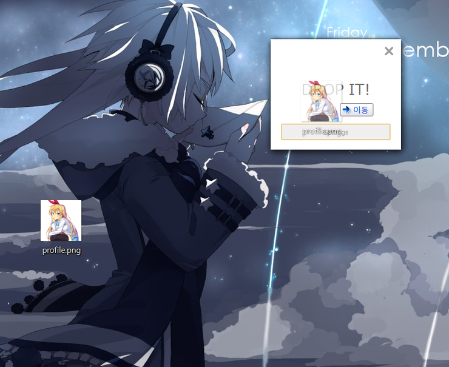
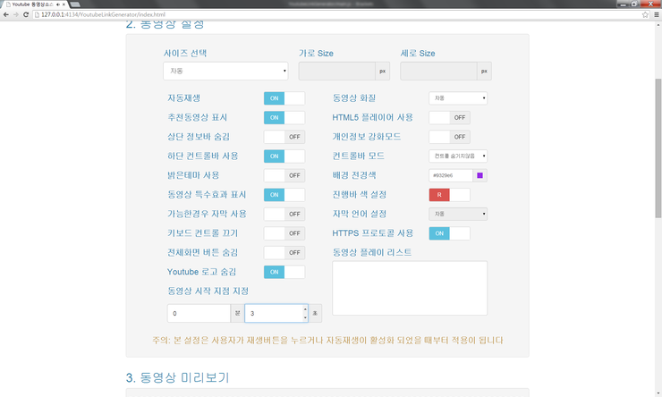

# Legacy

> :beginner: A repository of my legacy non-git projects

Just note that all those codes are pretty old and may be outdated, so may or may not work anyhow. Please keep in mind that in case if you are going to reuse the code.

Back in the day, when I was working on those projects, I didn't aware the importance of internationalization unlike now. So you may notice that the language used in the applications are all writen in Korean. I hope you can manage it properly with the service like [Google Translate](https://translate.google.com/) :joy:.

## Projects

### [`image-converter`](projects/image-converter)

> Images to any images in single drag-and-drop (based on [nw.js][nwjs])

### [`image-scraper`](projects/image-scraper)

> Website image scrapper (based on [nw.js][nwjs])

### [`music-player`](projects/music-player)

> Simple `iframe` based web music player

**Note:** Please note that I removed all original musics not to violate copyrights of the musics.

### [`naver-blog-feeder`](projects/naver-blog-feeder)

> [Naver](https://www.naver.com/) blog service feed notificator

### [`random-picker`](projects/random-picker)

> Roll the dice to pick the winner

### [`simple-encrypt`](projects/simple-encrypt)

> Simple AES based file encryptor (based on [nw.js][nwjs])

### [`steam-id-converter`](projects/steam-id-converter)

> Convert legacy steam id to new one

### [`youtube-downloader`](projects/youtube-downloader)

> Youtube video downloader and music converter with PHP

### [`youtube-source-generator`](projects/youtube-source-generator)

> Youtube video embed style generator

## License

All the projects are licensed under [MIT](http://preco.mit-license.org/)

[nwjs]: http://nwjs.io/
